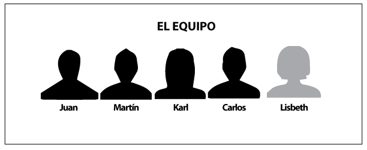
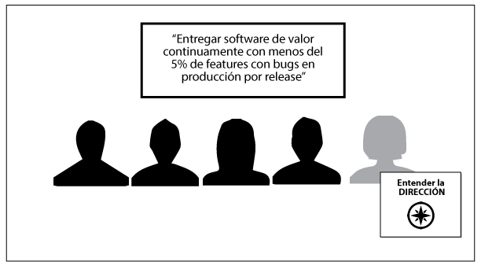
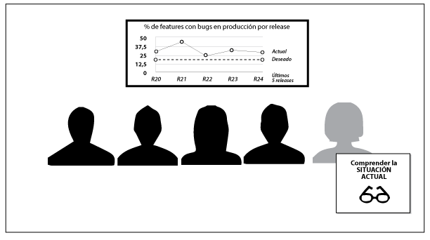
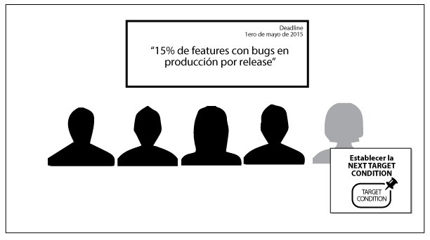
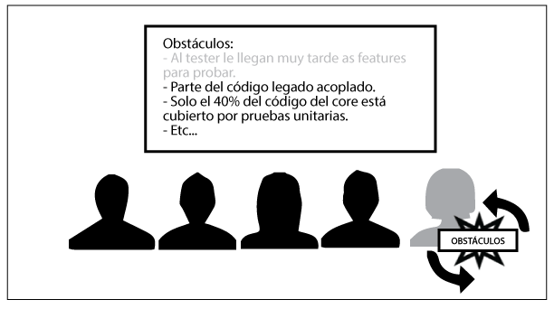
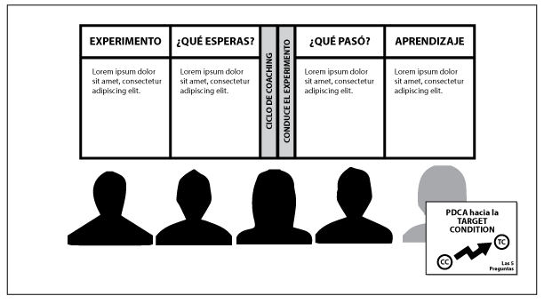

# Improvement Kata

Por Hiroshi Hiromoto, @hhiroshi

## **Palabras clave**

mejora continua, generación de valor, auto-organización, kaizen, lean

## **Intención**

En muchas organizaciones algo recurrente es el deseo por ser mejores en algún aspecto, ya sea en reconocimiento, en ganancias, en la calidad de su producto o felicidad de sus colaboradores. Algo igual de recurrente, independientemente de sus desafíos, es que existe una gran dificultad para convertir esos deseos en mejoras concretas y una mayor dificultad aún, para sostenerlas en el tiempo.

Improvement Kata es un patrón que nos ayuda a lograr convertir esos deseos en mejoras concretas.

## **Motivación**

Si bien Improvement Kata puede ser utilizado a diferentes niveles de una organización (C-Level, _middle management_, áreas, equipos, etc), este capítulo estará enfocado en su uso a nivel de equipo; en particular en equipos que se desenvuelven en el trabajo del conocimiento.

En estos equipos, independientemente de si están desarrollando software, definiendo estrategias, creando campañas de marketing, transformando una organización o diseñando un servicio, existe un alto grado de incertidumbre en cómo superar los desafíos a los que se enfrentan. Esta característica en particular hace que la posibilidad de crear una planificación prescriptiva para afrontar sus desafíos sea poco realista, y que aparezca la necesidad de utilizar un marco que pueda ser adaptativo.

Por ejemplo en el _Agile Manifesto_ [Manifesto 2001], la necesidad de poder generar mejoras a la forma de trabajo de forma adaptativa se ve reflejada en el siguiente principio ágil:

_“A intervalos regulares el equipo reflexiona sobre cómo ser más efectivo para a continuación ajustar y perfeccionar su comportamiento en consecuencia.”_

Donde el uso de intervalos de tiempo, permite hacer ajustes y reflexionar sobre los cambios que se vienen adoptando.

Asimismo, si revisamos la definición [Scrum Guide 2016] de la reunión de retrospectiva en Scrum (una práctica que se basa en el principio que acabamos de revisar), nos encontramos con:

_“La Sprint Retrospective es una oportunidad para el Scrum Team para inspeccionarse y crear un plan de mejoras a ser ejecutadas durante el siguiente Sprint.”_

Donde los intervalos regulares han sido reemplazados por el Sprint y se hace más foco en la inspección que en la reflexión. Además, al ser una reunión, la incorporación de las mejoras queda fuera del alcance de la misma (dado que se realiza durante el Sprint).

Si tenemos en cuenta que la retrospectiva es la práctica más utilizada [ScrumAlliance 2015] por los practicantes de Scrum (80%), siendo este el framework más utilizado en el mundo ágil, uno podría pensar que muchos de los equipos ágiles están constantemente moviéndose hacia el logro de sus desafíos.

Lamentablemente, en mi experiencia, pocos son los equipos que están logrando mejorar continuamente con cadencia y resultados tangibles. Muchos podrán argumentar que la mayoría de retrospectivas están llenas de anti-patrones que las hacen inefectivas (con lo que estoy de acuerdo), pero creo que no es la única razón por la que no se ven resultados.

Mi hipótesis (que he ido validando con equipos a los que acompaño) es que hay tres elementos que hacen falta en la mayoría de sesiones de mejora para que estas sean efectivas.

*   El primer elemento es la ausencia de un desafío claro y preciso, que vaya mucho más allá de “ser más efectivos” (como dice el principio ágil), y que permita generar foco en las iniciativas de mejora que nos lleven de la pregunta “qué podemos mejorar” a la pregunta “qué debemos mejorar”.
*   El segundo elemento es un mecanismo que nos ayude a recorrer el camino hacia ese desafío. Que evite que tengamos sesiones Whack-a-Mole (como el juego de arcade), en donde simplemente estemos reaccionando de forma instintiva ante lo que aparece al frente de nuestros ojos, sin tener en cuenta todo el panorama ni las causas raíces de los problemas.
*   El tercer y último elemento es la experimentación sobre los planes de acción como indica Hiromoto [Hiromoto 2014], que permite hacer foco en los impactos que queremos generar y amplifique el aprendizaje cuando no logramos esos impactos con nuestras hipótesis.

Si bien es cierto que he visto equipos aplicar estos tres elementos en una retrospectiva, me parece más natural utilizar un patrón que ya las contenga por diseño, y es ahí donde entra Improvement Kata.

## **Descripción**

Antes de profundizar en Improvement Kata, quisiera comentar brevemente sobre el concepto de la _kata_, ya que da las bases para entender la importancia del patrón.

### Kata

_La kata_ es un concepto que viene de las artes marciales. De forma general es un patrón que repites continuamente de forma deliberada para generar memoria muscular y luego realizarlo casi sin pensar. Por ejemplo en la película Karate Kid [Karate Kid 1984], Daniel repetía el movimiento de _encerar y pulir_ para tenerlo interiorizado y poder utilizarlo en la pelea de karate de forma natural, casi automática.

En el caso de Improvement Kata, este es un patrón que repetimos para generar una memoria muscular de mejora, de forma que se vuelva un hábito.

### Improvement Kata

Improvement Kata [Rother 2009] está enfocado en ayudarnos a dar pasos que nos permitan ir acercándonos al desafío mejorando continuamente. A grandes rasgos tiene dos etapas: una de planificación y otra de experimentación, que se repiten cíclicamente.

#### Etapa de planificación

En esta etapa se genera la parte estratégica de Improvement Kata, así como el seteo inicial que nos permitirá experimentar. Existen cuatro elementos a tomar en cuenta:

El desafío

El desafío es aquel reto, alineado con una visión, que tiene el equipo y es el motivo por el cual se está usando Improvement Kata. Uno puede decir que ese desafío es relevante cuando cumple las siguientes tres características:

*   Dirección: Brinda una dirección al equipo, que les permite avanzar.
*   Tensión positiva: Genera una tensión positiva hacia el desafío, parecida a la fuerza de la gravedad. Ya que la forma en cómo hacemos las cosas (_status quo_) genera una tensión que evita cambios, la tensión del desafío debe ser superior para permitir que el equipo se mueva.
*   Significado de ganar: Tener un desafío claro nos permite entender qué significa ganar en nuestro contexto, dentro de la definición de _ganar_ de Kofman [Kofman 2006].

Situación Actual

La situación actual son los hechos y datos que te dicen dónde está el equipo hoy en día en función del desafío. La situación actual usualmente tiene varios componentes como:

*   Diagrama de bloque del proceso: Una representación de cómo se hacen las cosas hoy en día.
*   Métricas de proceso: Indicadores claves de performance que nos permitan evaluar cómo funciona el proceso.
*   Métricas de resultado: Indicadores claves de performance que nos permitan evaluar el resultado generado.
*   Características del proceso: Datos adicionales contextuales que nos ayuden a entender mejor la situación.

Siguiente Condición Objetivo

La siguiente condición objetivo es la descripción de dónde quiere estar el equipo en un determinado periodo de tiempo. Funciona como punto intermedio entre la situación actual y el desafío. Además nos permite enfocarnos entre lo que podemos hacer y lo que tenemos que hacer.

La siguiente condición objetivo usualmente tiene varios componentes como:

*   Fecha límite: Momento en el tiempo en donde el equipo espera estar en la situación descrita.
*   Diagrama de bloque del proceso: Una representación de cómo se harían las cosas.
*   Métricas de proceso: Números que deberían alcanzar los indicadores claves de performance que miden el proceso.
*   Métricas de resultado: Números que deberían alcanzar los indicadores claves de performance que miden el resultado generado.
*   Características del proceso: Datos adicionales contextuales que deberían ser diferentes en la situación descrita.

Algo a tener en cuenta es que una siguiente condición objetivo no requiere cambios en cada uno de los componentes descritos. Esto significa que un equipo puede plantearse una siguiente condición objetivo modificando únicamente el valor de un indicador y dejando el resto tal como está.

Obstáculos

Los obstáculos son una lista de elementos que te impiden estar en la siguiente condición objetivo. Estos pueden tomar forma de problemas, impedimentos o contextos.

#### Etapa de Experimentación

En esta etapa es donde ocurre toda la magia y es el momento en dónde se ponen a prueba las hipótesis y se genera el aprendizaje.

Ciclos PHVA

Una vez que están identificados los obstáculos se procede a elegir uno y tratar de removerlo a través de experimentos. La ejecución se realiza siguiendo ciclos de PHVA (Planear, Hacer, Verificar y Actuar), en donde primero se define un experimento que incluye la generación de una hipótesis y su resultado esperado. Luego de la definición del experimento, se procede a ejecutarlo, para luego revisar los resultados y capitalizar el aprendizaje.

Algo importante a notar es que Improvement Kata promueve el uso de los experimentos de factor único (_single-factor experiments_), que implican hacer un solo cambio a la vez, lo que permite capitalizar el aprendizaje de forma más efectiva.

_**Figura 12.1**. Improvement Kata_

### Ejemplo de aplicación de Improvement Kata 

Para hacer más didáctica la explicación usaré un ejemplo simplificado de aplicación en un equipo de desarrollo de software.

Les presento a Juan, Karl, Martín, Carlos y Lisbeth (Team Leader). Ellos son un equipo de desarrollo que trabaja desarrollando y dando soporte a la aplicación de ventas de su organización.

_**Figura 12.2**. El equipo_

En la empresa donde trabaja el equipo, el área de tecnología tiene una visión común que es:

_“Ser un brazo estratégico del desarrollo del negocio a través de tecnología."_

#### El desafío

Con la visión en mente tanto Lisbeth como el director de IT llegaron a un consenso sobre el desafío que tienen tomando en cuenta la visión del área:

_“Entregar software de valor continuamente con menos del 5% de funcionalidades con bugs en producción por release."_

_**Figura 12.3**. El desafío_

#### Situación Actual

Con el desafío claro, Lisbeth se reúne con su equipo en el lugar del trabajo, para que juntos determinen la situación actual.

Ellos actualmente utilizan un tablero kanban y tienen algunas métricas tanto del proceso como del resultado. Basado en eso la condición actual es:

_**Figura 12.4**. La situación actual_

Nota: La definición de la situación actual está simplificada para el ejemplo.

#### Siguiente Condición Objetivo

Una vez conscientes de la situación actual, Lisbeth junto con el equipo se proponen una siguiente condición objetivo que debería ser cumplida en dos meses. Consiste en reducir el porcentaje de bugs:

_“15% de features con bugs en producción por release”_

**_Figura 12.5**. La siguiente condición objetivo_

#### Obstáculos

Ahora que Lisbeth y el equipo tienen una meta clara a cumplir en los dos siguientes meses, pueden comenzar a pensar en los obstáculos que actualmente están evitando que estén en esa situación deseada. Luego de un poco de brainstorm, análisis y discusión, llegaron a la siguiente lista:

_
**Figura 12.6**. Los obstáculos_

De todos estos obstáculo, ellos han decidido atacar el obstáculo en naranja primero.

Con esto el equipo ha terminado la etapa de planificación de Improvement Kata y están listos para iniciar la etapa de ejecución, es decir, están listos para experimentar.

#### Ciclos PDCA

Luego de una conversación sobre cuál debería ser su primer experimento para buscar remover el obstáculo seleccionado, Lisbeth y el equipo determinan que probarán lo siguiente:

*   Experimento: Hacer pairing con el tester antes de iniciar el desarrollo de una nueva funcionalidad.
*   Resultado esperado: Que el tester tenga contexto del feature y pueda preparar con tiempo el set de pruebas. Con esto aumentar, en al menos 1 día, el tiempo de ejecución efectiva de pruebas, incluyendo las exploratorias.

_**Figura 12.7**. Experimentos_

Finalmente ahora que entendemos cómo funciona Improvement Kata solo queda resaltar que dado que las katas están diseñadas para ayudar a la persona a recorrer un camino, es relevante entender que el uso del patrón tal como está presentado solo es el inicio. Así que hago la invitación a ¡comenzar a recorrerlo!